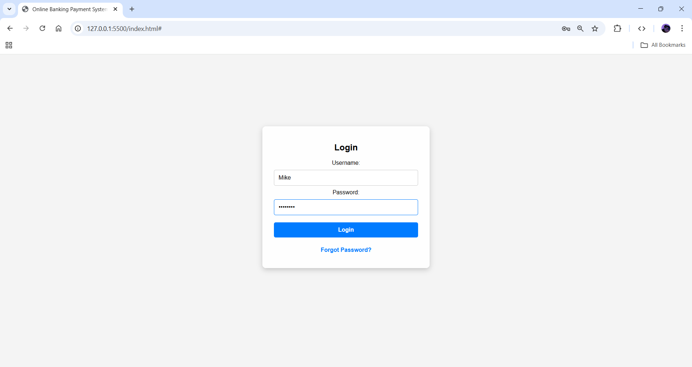
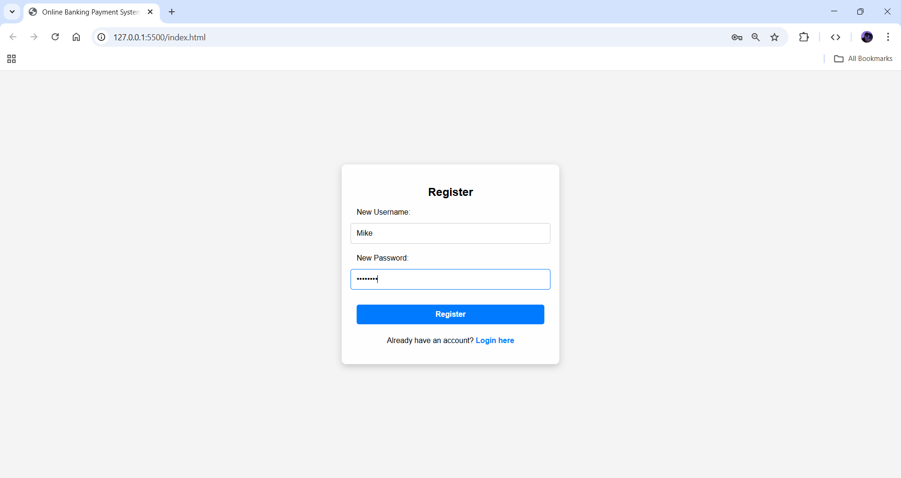
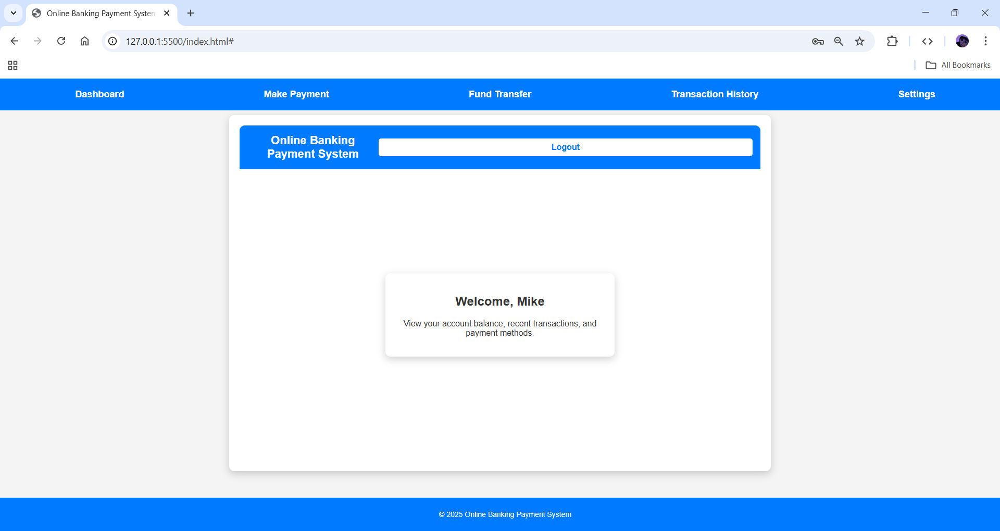
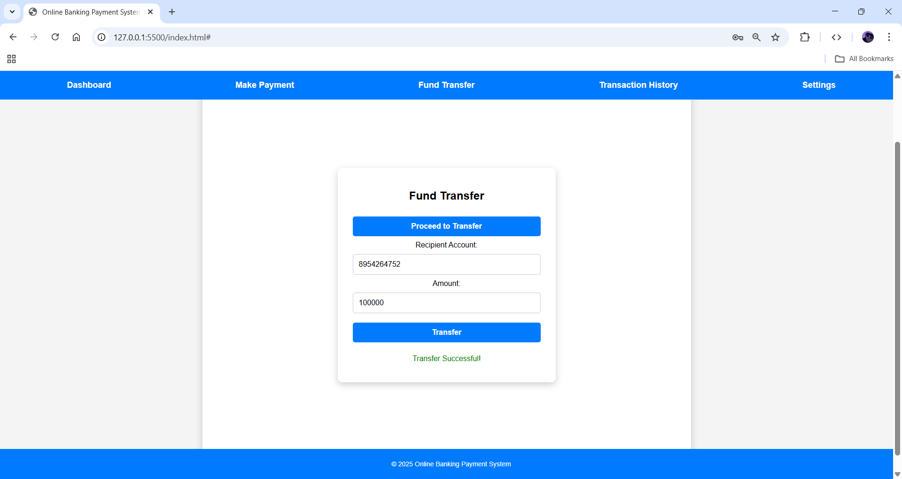
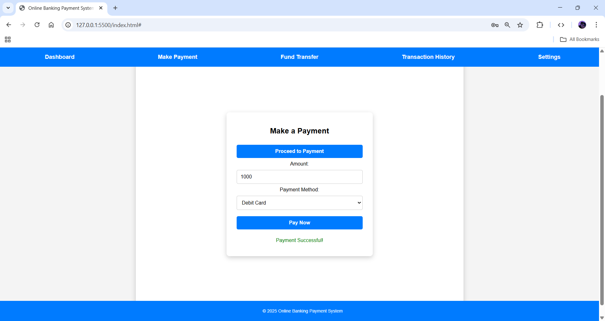

# Online Banking Payment System

An **Online Banking Payment System** built using **HTML, CSS, and JavaScript**, allowing users to securely register, log in, make payments, transfer funds, view transaction history, and log out.  

---

## 🚀 Features
- User registration and login system  
- Secure fund transfers  
- Make online payments  
- Transaction history tracking  
- User-friendly dashboard  
- Logout functionality  

---

## 🛠️ Technologies Used
- **Frontend:** HTML, CSS, JavaScript  
- **Version Control:** Git & GitHub  

---

## 📸 Screenshots

### 1. Login Page


### 2. Register Page


### 3. Dashboard


### 4. Fund Transfer


### 5. Make Payment


### 6. Transaction History


### 7. Logout


---

## 💻 How to Run Locally

1. Clone the repository:  
   ```bash
   git clone https://tanushrisv.github.io/online_banking_payment_system/
